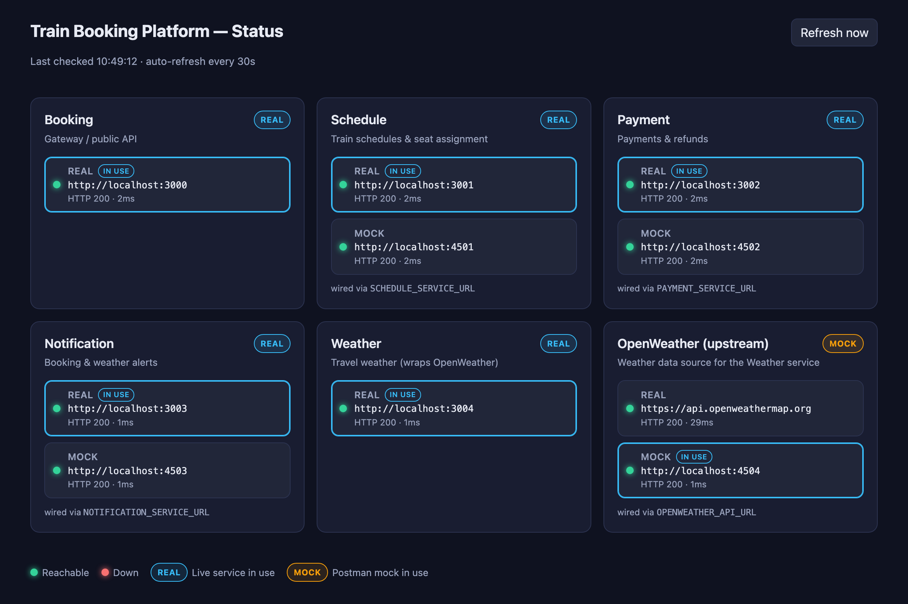
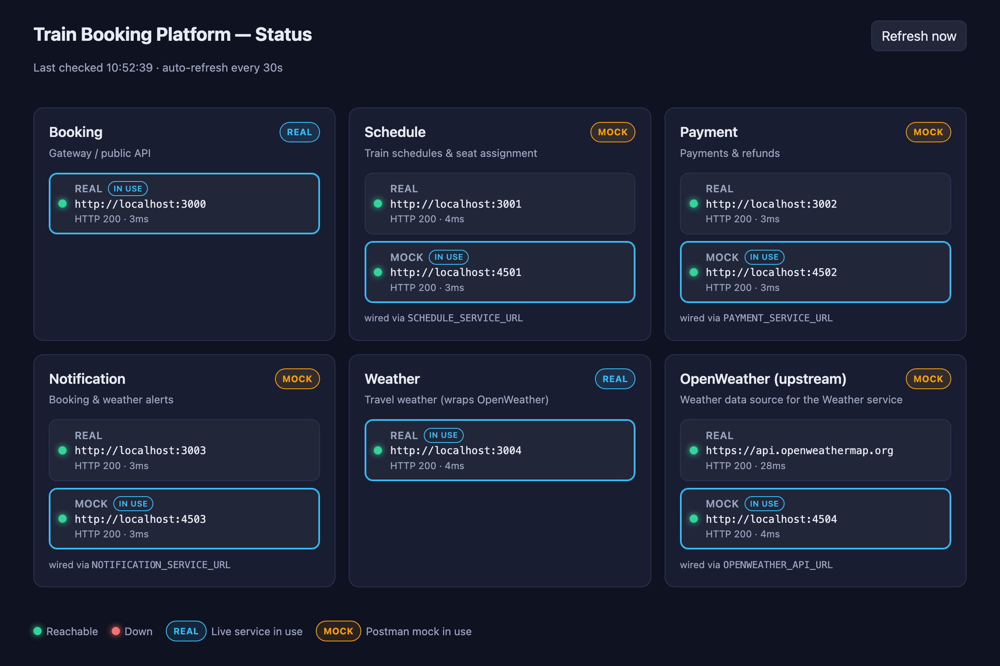

<p align="center">
	
</p>

<p align="center">
	<em>A fork-and-run Node.js microservices playground — five Express services, drop-in Postman mocks, and a live status dashboard.</em>
</p>

---

**Railyard** is a small but complete train-booking platform built from independent
Express microservices. It's designed to be **cloned and running in under a minute**,
and to make the "real service vs. mock" story easy to see and control — every
dependency can be swapped for a local Postman mock with a single command, and a
built-in **status dashboard** shows you exactly what's up and which target
traffic is flowing to.

## Contents

- [Features](#features)
- [Architecture](#architecture)
- [Quick start](#quick-start)
- [Services & ports](#services--ports)
- [Command reference](#command-reference)
- [Real vs. mock — how it works](#real-vs-mock--how-it-works)
- [Status dashboard](#status-dashboard)
- [Environment config](#environment-config)
- [API examples](#api-examples)
- [Postman workspace](#postman-workspace)
- [Project structure](#project-structure)

## Features

- **Five focused microservices** — Booking (gateway), Schedule, Payment,
  Notification, and Weather, each an independent Express app.
- **One-command startup** — `npm run dev` boots every service together with
  colour-prefixed logs.
- **Drop-in Postman mocks** for every dependency, on dedicated ports, with
  `dev:mock:*` scripts that wire services to mocks **without editing `.env`**.
- **Live status dashboard** at `http://localhost:3005` — health of every real
  service and mock, plus a badge showing whether the **real** or the **mock** is
  currently wired in.
- **Fork-friendly** — a complete `.env.example`, no build step, and only two
  runtime dependencies (`express`, `dotenv`).

## Architecture

```
                                   ┌───────────────────────────┐
                                   │     Status Dashboard      │  :3005
                                   │  probes everything below  │
                                   └───────────────────────────┘

┌──────────────────────┐
│   Booking Service    │  :3000  (public API / gateway)
│                      │
│  GET  /search        │──────▶  Schedule Service      :3001  ⇄  mock :4501
│  POST /bookings      │──────▶  Schedule Service      :3001  ⇄  mock :4501
│  POST /bookings/:ref/pay ───▶  Payment Service       :3002  ⇄  mock :4502
│  POST /bookings/:ref/refund ▶  Payment Service       :3002  ⇄  mock :4502
│  GET  /bookings/:ref │──────▶  Weather Service       :3004
└──────────────────────┘   │
                           └──▶  Notification Service  :3003  ⇄  mock :4503

                                Weather Service :3004
                                   └──▶ OpenWeather API  ⇄  mock :4504
```

Each `⇄ mock :45xx` pairing is a Postman local mock that can stand in for the
real dependency. The Booking Service is the only public entry point; everything
else is an internal dependency it orchestrates.

## Quick start

> Requirements: **Node.js 18+** (uses the built-in `fetch`). The Postman mocks
> use the [Postman CLI](https://learning.postman.com/docs/postman-cli/postman-cli-overview/).

```bash
# 1. Fork on GitHub, then clone your fork
git clone https://github.com/<you>/train-booking-platform.git
cd train-booking-platform

# 2. Install dependencies
npm install

# 3. Create your local env from the template
cp .env.example .env

# 4. Start every service (plus the status dashboard)
npm run dev
```

Then open the dashboard to see everything at a glance:

```
http://localhost:3005
```

…and hit the public API:

```bash
curl "http://localhost:3000/search?from=London&to=Manchester"
```

## Services & ports

| Service               | Port   | Role                                            | Has mock? |
|-----------------------|--------|-------------------------------------------------|-----------|
| **Booking**           | `3000` | Public API / gateway that orchestrates the rest | —         |
| **Schedule**          | `3001` | Train timetables & seat assignment              | `4501`    |
| **Payment**           | `3002` | Payments & refunds                              | `4502`    |
| **Notification**      | `3003` | Booking confirmations & weather alerts          | `4503`    |
| **Weather**           | `3004` | Travel weather (wraps the OpenWeather API)      | —         |
| OpenWeather (upstream)| —      | 3rd-party weather data source                   | `4504`    |
| **Status dashboard**  | `3005` | Read-only health & mock/real view               | —         |

## Command reference

### Run the services

| Command                   | What it does                                              |
|---------------------------|----------------------------------------------------------|
| `npm run dev`             | All real services + the status dashboard, one terminal   |
| `npm run start:booking`   | Booking Service only (`:3000`)                            |
| `npm run start:schedule`  | Schedule Service only (`:3001`)                           |
| `npm run start:payment`   | Payment Service only (`:3002`)                            |
| `npm run start:notification` | Notification Service only (`:3003`)                   |
| `npm run start:weather`   | Weather Service only (`:3004`)                            |
| `npm run start:status`    | Status dashboard only (`:3005`)                           |

### Run the services against mocks

These override the relevant `*_SERVICE_URL` inline, so **your `.env` is never
touched** — stop the script and you're back to real dependencies.

| Command                        | Schedule | Payment | Notification | OpenWeather |
|--------------------------------|:--------:|:-------:|:------------:|:-----------:|
| `npm run dev`                  | real     | real    | real         | real        |
| `npm run dev:mock:schedule`    | **mock** | real    | real         | real        |
| `npm run dev:mock:payment`     | real     | **mock**| real         | real        |
| `npm run dev:mock:notification`| real     | real    | **mock**     | real        |
| `npm run dev:mock:openweather` | real     | real    | real         | **mock**    |
| `npm run dev:mock:all`         | **mock** | **mock**| **mock**     | **mock**    |

### Run the mocks

The `dev:mock:*` scripts only *point* services at the mock ports — you still need
the mock servers running (in a separate terminal).

| Command                     | Starts                                       |
|-----------------------------|----------------------------------------------|
| `npm run mocks:start`       | All four Postman mocks at once (`4501`–`4504`)|
| `npm run mocks:schedule`    | Schedule mock (`:4501`)                       |
| `npm run mocks:payment`     | Payment mock (`:4502`)                        |
| `npm run mocks:notification`| Notification mock (`:4503`)                   |
| `npm run mocks:openweather` | OpenWeather mock (`:4504`)                    |

### How they work together

A typical "develop against mocks" session uses two terminals:

```bash
# Terminal 1 — start the mock servers you need
npm run mocks:start

# Terminal 2 — start the services wired to those mocks
npm run dev:mock:all
```

Open `http://localhost:3005` and every mocked dependency shows a **MOCK** badge
with a green dot. Need an ad-hoc mix? Prefix `npm run dev` with your own
overrides — no script required:

```bash
SCHEDULE_SERVICE_URL=http://localhost:4501 \
PAYMENT_SERVICE_URL=http://localhost:4502 \
npm run dev
```

## Real vs. mock — how it works

Every consumer reads its target from `config/endpoints.js`, which resolves each
`*_SERVICE_URL` (and `OPENWEATHER_API_URL`) from the environment, falling back to
the real `localhost` port. Switching to a mock is therefore just a matter of
pointing that URL at the mock's port — nothing in the service code changes.

- **Real ports:** `3001`–`3004` (and OpenWeather's public API).
- **Mock ports:** `4501`–`4504` (Postman local mocks under `postman/mocks/`).

The `dev:mock:*` scripts set the URL(s) for you; the status dashboard reads the
*same* resolution to decide which target is "in use". See the next section.

## Status dashboard

A lightweight Express page at **`http://localhost:3005`** that checks the whole
platform and refreshes every 30 seconds (with a manual **Refresh now** button).

<p align="center">
	
</p>

<p align="center">
	<em>All services green, with OpenWeather wired to its mock (MOCK &middot; in use) while the rest run against the real services.</em>
</p>

Running `npm run dev:mock:all` swaps every mockable dependency at once:

<p align="center">
	
</p>

<p align="center">
	<em>With <code>dev:mock:all</code>, Schedule, Payment, Notification and OpenWeather all show MOCK &middot; in use. Booking and Weather stay REAL &mdash; they're the platform's own services and have no mock counterpart.</em>
</p>

For each dependency it shows **two independent signals**:

1. **Reachability (the green/red dot)** — the dashboard actively sends a request
   to *both* the real port and the mock port (e.g. `GET :4504/ping`) and reports
   which is answering. This is a live network check, independent of any env var.
2. **In use (the MOCK / REAL badge)** — derived from `config/endpoints.js`, i.e.
   the resolved `*_SERVICE_URL` / `OPENWEATHER_API_URL`. This tells you which
   target traffic is actually routed to right now.

So a green dot on the mock row **and** a MOCK badge means the mock is both up
*and* wired in. A MOCK badge with a red dot is the useful "you've pointed at the
mock but it isn't running" warning.

> **Tip — view it inside Postman.** Postman has an in-app **Browser** tab. Open a
> new browser tab in Postman and navigate to `http://localhost:3005` to keep the
> live status alongside your collections and requests, without leaving the app.

The dashboard also exposes a JSON endpoint if you want to script against it:

```bash
curl http://localhost:3005/api/status
```

## Environment config

Copy `.env.example` to `.env`. The key variables:

| Variable                   | Default                          | Description                                       |
|----------------------------|----------------------------------|---------------------------------------------------|
| `BOOKING_PORT`             | `3000`                           | Port for the Booking Service                      |
| `BOOKING_SERVICE_URL`      | `http://localhost:3000`          | Public API base URL                               |
| `SCHEDULE_PORT`            | `3001`                           | Port for the Schedule Service                     |
| `SCHEDULE_SERVICE_URL`     | `http://localhost:3001`          | URL the Booking Service calls (point at `:4501` for mock) |
| `PAYMENT_PORT`             | `3002`                           | Port for the Payment Service                      |
| `PAYMENT_SERVICE_URL`      | `http://localhost:3002`          | URL the Booking Service calls (point at `:4502` for mock) |
| `NOTIFICATION_PORT`        | `3003`                           | Port for the Notification Service                 |
| `NOTIFICATION_SERVICE_URL` | `http://localhost:3003`          | URL the Booking Service calls (point at `:4503` for mock) |
| `WEATHER_PORT`             | `3004`                           | Port for the Weather Service                      |
| `WEATHER_SERVICE_URL`      | `http://localhost:3004`          | URL the Booking Service calls                     |
| `OPENWEATHER_API_URL`      | `https://api.openweathermap.org` | Upstream OpenWeather base URL (point at `:4504` for mock) |
| `OPENWEATHER_API_KEY`      | `dev-placeholder-key`            | API key for the real OpenWeather API              |
| `STATUS_PORT`              | `3005`                           | Port for the status dashboard                     |

## API examples

### Search for trains

```bash
curl "http://localhost:3000/search?from=London&to=Manchester&date=2026-07-08"
```

### Create a booking

```bash
curl -X POST http://localhost:3000/bookings \
  -H "Content-Type: application/json" \
  -d '{
    "trainId": "T100",
    "seatClass": "standard",
    "passengers": [
      { "name": "Alice Smith" },
      { "name": "Bob Jones" }
    ]
  }'
```

### Pay for a booking

```bash
curl -X POST http://localhost:3000/bookings/BR-XXXXXXXX/pay \
  -H "Content-Type: application/json" \
  -d '{ "cardNumber": "4242424242424242", "cardHolder": "Alice Smith", "expiryDate": "12/28", "cvv": "123" }'
```

### Refund a booking

```bash
curl -X POST http://localhost:3000/bookings/BR-XXXXXXXX/refund \
  -H "Content-Type: application/json" \
  -d '{ "reason": "Customer requested refund" }'
```

### Get a booking (enriched with destination weather)

```bash
curl http://localhost:3000/bookings/BR-XXXXXXXX
```

### Call dependent services directly

```bash
# Schedules
curl "http://localhost:3001/schedules?from=London&to=Edinburgh"
curl http://localhost:3001/schedules/T200

# Payments
curl -X POST http://localhost:3002/payments \
  -H "Content-Type: application/json" \
  -d '{ "amount": 45, "currency": "GBP", "bookingRef": "BR-TEST0001" }'

# Notifications
curl -X POST http://localhost:3003/notifications \
  -H "Content-Type: application/json" \
  -d '{ "type": "booking_confirmation", "recipient": "Alice Smith", "bookingRef": "BR-TEST0001" }'

# Weather
curl "http://localhost:3004/weather?city=Manchester"
```

### Health checks

```bash
for p in 3000 3001 3002 3003 3004 3005; do curl -s "http://localhost:$p/ping"; echo; done
```

## Postman workspace

The `postman/` directory contains everything to exercise the platform from
Postman:

- **`collections/`** — a request collection per service, plus a **Booking E2E
  Flow** that runs search → book → pay → refund end to end.
- **`environments/`** — a ready-made environment with the service URLs.
- **`mocks/`** — the local mock definitions (`*.json`) and their handlers
  (`*.js`) that back the `mocks:*` scripts.

## Project structure

```
train-booking-platform/
├── assets/
│   └── logo.svg                # App logo
├── config/
│   ├── endpoints.js            # Resolves ports & *_SERVICE_URL (real ⇄ mock)
│   └── load-env.js             # Loads .env
├── scripts/
│   ├── run-dev.js              # Boots all services + dashboard (concurrently)
│   └── run-mocks.js            # Boots all Postman mocks (concurrently)
├── services/
│   ├── booking/                # Gateway / public API (:3000)
│   ├── schedule/               # Timetables & seats (:3001)
│   ├── payment/                # Payments & refunds (:3002)
│   ├── notification/           # Notifications (:3003)
│   ├── weather/                # Weather, wraps OpenWeather (:3004)
│   └── status/                 # Status dashboard (:3005)
├── postman/                    # Collections, environment & mocks
├── .env.example                # Copy to .env
└── package.json
```

## License

Provided as-is for learning and experimentation — fork it, break it, build on it.
